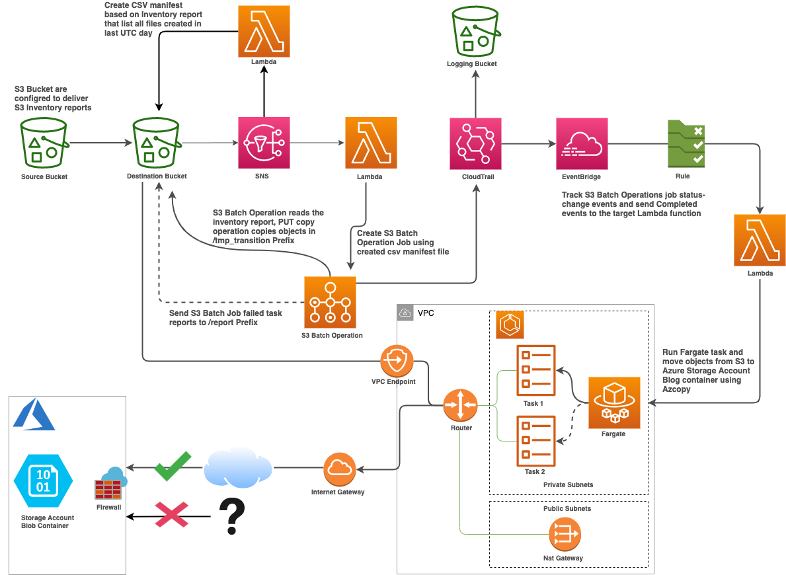

# An Automated Data Pipeline to Copy Data from Amazon S3 to Azure Storage

This repo provide approach to build a data pipeline to copy data periodically from S3 to Azure Storage using AWS Data Wrangler, Amazon S3 Inventory, Amazon S3 Batch Operations, Athena, Fargate, and AzCopy.


For more details, please https://yia333.medium.com/building-an-automated-data-pipeline-to-copy-data-from-amazon-s3-to-azure-storage-2a1b8d1ac6eb

## Deploy AWS Stack

```
cd CDK-S3toblob
pip install -r requirements.txt
cdk deploy
```

## Deploy Azure Storage Account

ARM Template is in `/Azure-Template-DemoRG`, modify it and then deploy using Azure Cli.
OR
You can go to Azure portal, click on the Cloud Shell icon in the Azure Portal's header bar, and it will open the Cloud Shell.
Run following command:

```
az group create --name examplegroup --location australiaeast
az deployment group create --resource-group examplegroup --template-uri https://raw.githubusercontent.com/yai333/DataPipelineS32Blob/master/Azure-Template-DemoRG/template.json  --parameters storageAccounts_mydemostroageaccount_name=mydemostorageaccountaiyi --debug
```
